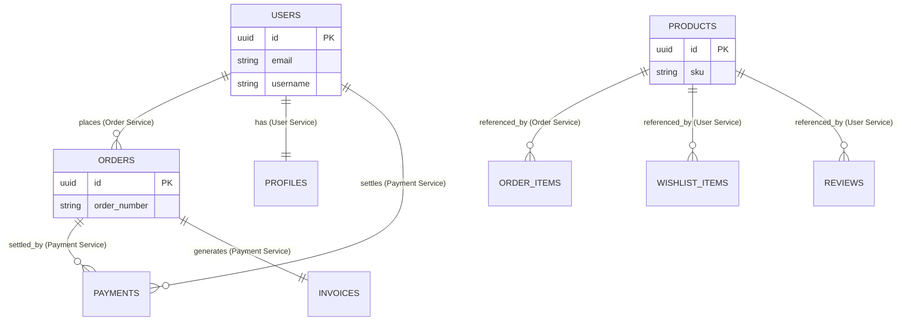
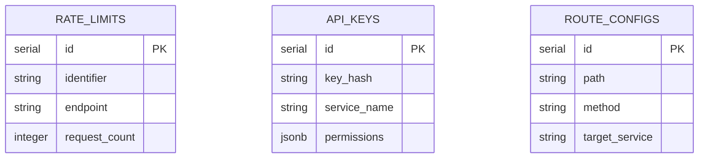
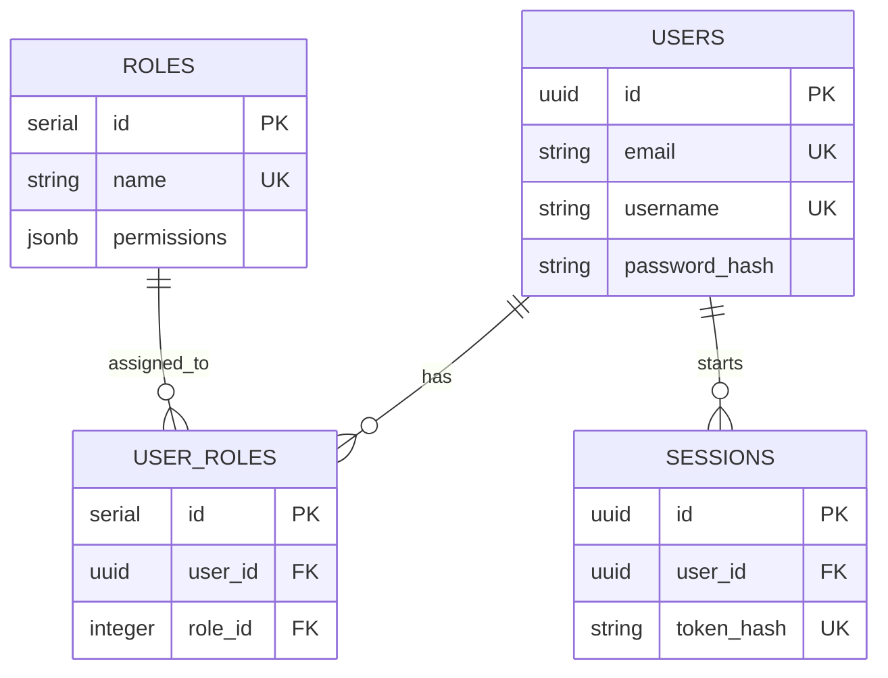
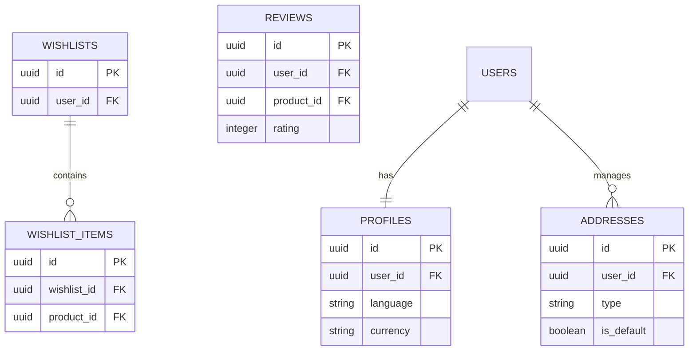
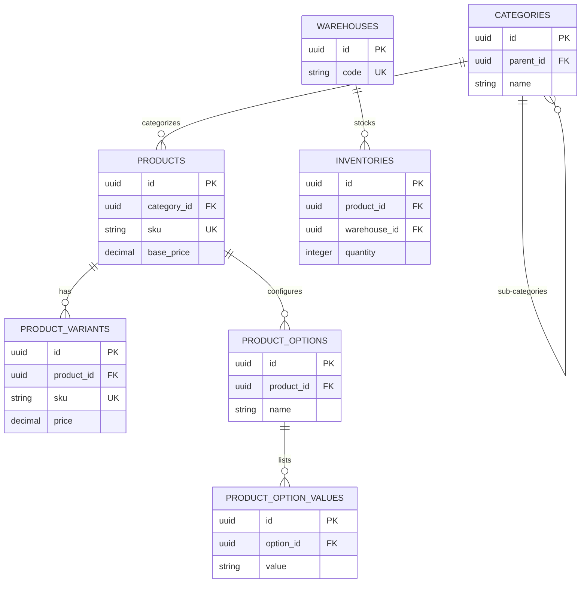
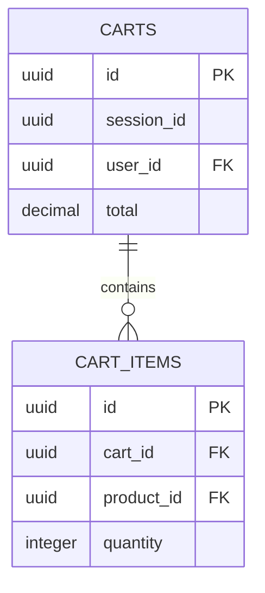
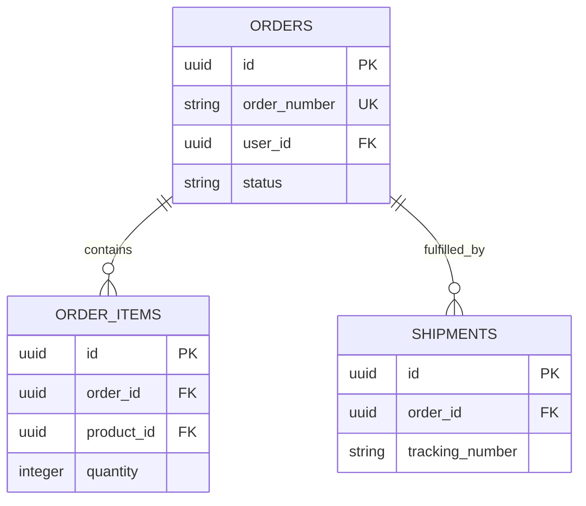
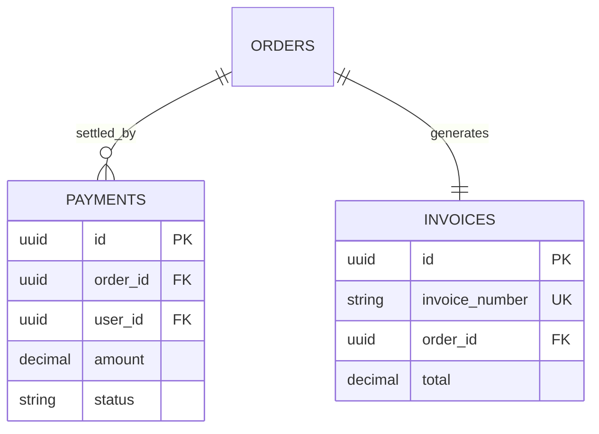
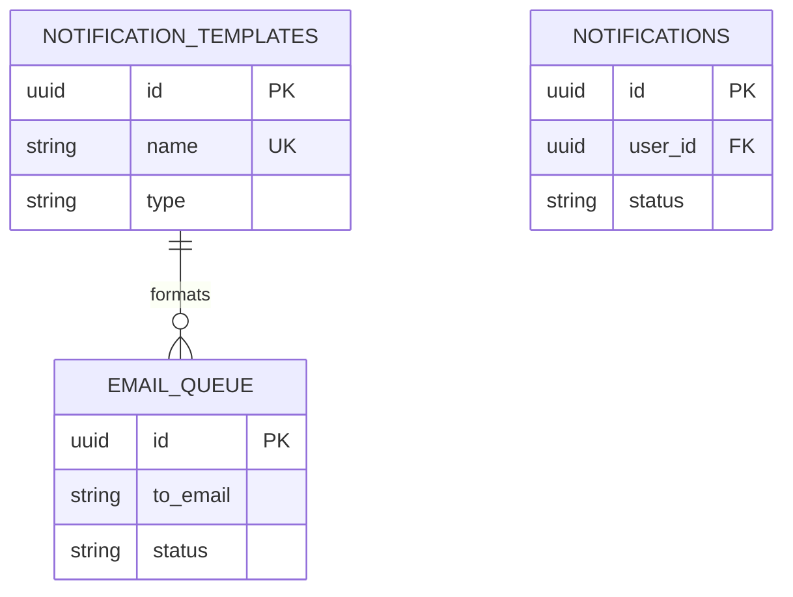
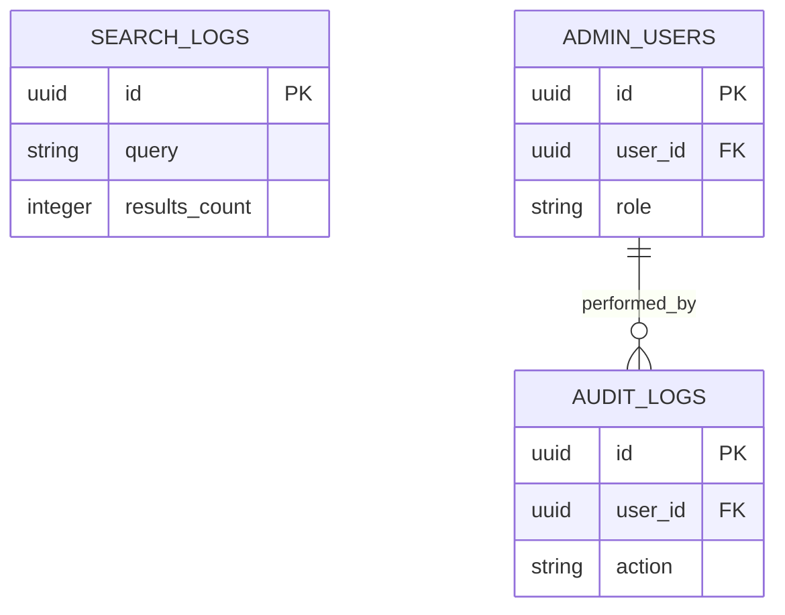

# Entity Relationship Diagrams

This document contains the visual ER diagrams for the e-commerce platform's microservices, derived from the `DATABASE_SCHEMA.md`.

## System Overview (Cross-Service)
This diagram shows how high-level entities reference each other across service boundaries via UUIDs.

---

## 1. API Gateway
Focuses on routing, rate limiting, and security.

---

## 2. Auth Service
Handles identity and access control.

---

## 3. User Service
Manages profiles, addresses, and social features.

---

## 4. Product Service
The core catalog and inventory management system.

---

## 5. Cart Service
Transient shopping state.

---

## 6. Order Service
Fulfillment lifecycle management.

---

## 7. Payment Service
Financial transactions and invoicing.

---

## 8. Notification Service
Messaging and template management.

---

## 9. Search & Admin Services
Analytics and system management.

